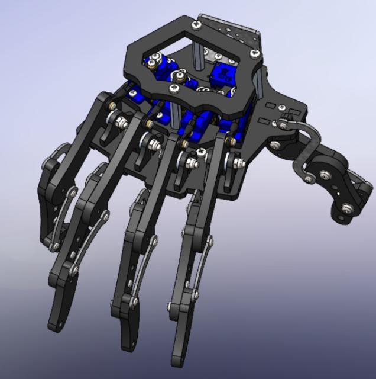
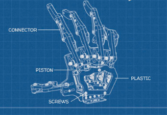
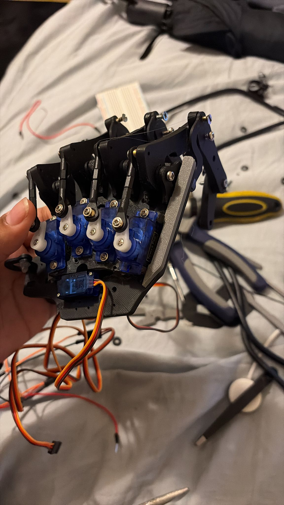
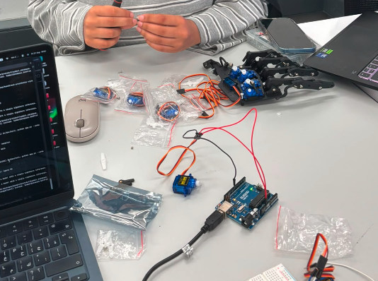

# Prosthetic Hand — Real-Time Finger Control via Hand Tracking

A vision-based prosthetic hand controller that uses a webcam and MediaPipe to detect hand gestures in real time and drive 5 independent servo motors — one per finger — on a 3D-printed robotic hand.

Each finger on the prosthetic mirrors the corresponding finger on the user's real hand. When you curl your index finger, the prosthetic index finger closes. When you open your hand, all fingers extend.

---

## Hardware

<table>
<tr>
<td></td>
<td></td>
<td></td>
</tr>
<tr>
<td align="center">CAD model</td>
<td align="center">Mechanical layout</td>
<td align="center">Assembled with micro servos</td>
</tr>
</table>

<br>



### Components

| Part | Details |
|---|---|
| Robotic hand | [Bionic Robot Hand — GrabCAD](https://grabcad.com/library/bionic-robot-hand-2) |
| Microcontroller | Arduino Uno R3 |
| Servos | 5× SG90 micro servos (one per finger) |
| Power supply | External 5V / 1.6A supply (see power notes below) |

### Wiring

| Servo | Finger | Arduino pin |
|---|---|---|
| Servo 1 | Thumb | 12 |
| Servo 2 | Index | 11 |
| Servo 3 | Middle | 10 |
| Servo 4 | Ring | 9 |
| Servo 5 | Pinky | 13 |

- Servo signal wires → Arduino pins 9–13
- Servo power (red) → external 5V supply
- Servo GND → external supply GND **and** Arduino GND (shared ground required)
- Arduino USB → computer (serial + programming)

### Power supply — important

Running 5 micro servos simultaneously requires significantly more current than a USB port or the Arduino's onboard 5V pin can provide.

**Issue encountered:** the first power supply did not provide enough current for all 5 servos. Under load the voltage dropped, causing servos to glitch, stall, or reset erratically.

**Solution:** use an external power supply providing:
- At least **1.6A** at 5V for the servos
- The Arduino itself can be powered separately via USB at 9V+ / 1000mA+

Do not power the servos from the Arduino 5V pin — it cannot supply enough current and will cause brownouts.

---

## How it works

```
Webcam → MediaPipe hand landmarks → per-finger curl detection → serial packet → Arduino → 5 servos
```

1. MediaPipe detects 21 hand landmarks at ~30fps
2. For each finger, tip and PIP joint positions are compared to determine if the finger is curled or extended
3. A vote counter (3 consecutive frames of agreement) filters out noise before committing a state change
4. A 6-byte serial packet `[0xAA, thumb, index, middle, ring, pinky]` is sent to the Arduino
5. The Arduino writes each servo simultaneously for synchronised movement
6. The thumb servo angle is inverted in firmware (mechanical reversal)

---

## Software demo


---

## Setup on macOS

### Prerequisites
- Python 3.12 (TensorFlow does not yet support 3.13+)
- A webcam

### Step 1 — Clone the repo

```bash
git clone https://github.com/obsdnx/handtrack-prosthetic.git
cd handtrack-prosthetic/montreal
```

### Step 2 — Create a virtual environment

```bash
python3.12 -m venv venv
source venv/bin/activate
```

### Step 3 — Install dependencies

```bash
pip install -r requirements.txt
```

### Step 4 — Grant camera access

macOS blocks camera access by default for terminal apps.

1. Open **System Settings → Privacy & Security → Camera**
2. Enable access for **Terminal** (or iTerm2, whichever you use)
3. If you never saw a permission dialog, reset and re-trigger it:
   ```bash
   tccutil reset Camera
   ```

### Step 5 — Run the app

```bash
./run.sh
```

Or manually:
```bash
source venv/bin/activate
python app.py --arduino
```

---

## Running scripts

See **`howto.txt`** in this directory for the full guide. Quick reference:

| Script | Firmware | What it does |
|---|---|---|
| `./run.sh` | `finger_control.ino` | Full app — live finger tracking via webcam |
| `python app.py --dry-run` | — | Camera tracking, logs to terminal only (no Arduino needed) |
| `python test_live_fingers.py` | `finger_control.ino` | Live tracking + Arduino with clear terminal output |
| `python test_finger_control.py` | `finger_control.ino` | Interactive — type a finger number and angle |
| `python test_servo_interactive.py` | `prosthetic_hand.ino` | Interactive — type an angle, all fingers move together |
| `python test_servo_direct.py` | `prosthetic_hand.ino` | Automated open/close sweep |

### Arduino firmware

Flash one of these via Arduino IDE:

| File | Description |
|---|---|
| `arduino/finger_control.ino` | Per-finger control — used by the main app |
| `arduino/prosthetic_hand.ino` | Simple open/close — all fingers move together |

See `arduino/howto.txt` for protocol details and wiring.

---

## Options

| Flag | Default | Description |
|---|---|---|
| `--arduino` | — | Connect to Arduino (auto-detect port) |
| `--arduino /dev/cu.xxx` | — | Specify port manually |
| `--dry-run` | — | Log to terminal without sending serial |
| `--list-ports` | — | Show available serial ports and exit |
| `--device` | `0` | Camera device index |
| `--width` | `960` | Capture width |
| `--height` | `540` | Capture height |
| `--min_detection_confidence` | `0.7` | Detection confidence threshold |
| `--min_tracking_confidence` | `0.5` | Tracking confidence threshold |

### Keyboard controls

| Key | Action |
|---|---|
| `ESC` | Quit |
| `k` | Enter keypoint logging mode |
| `h` | Enter point history logging mode |
| `n` | Exit logging mode |
| `0`–`9` | Label for the current gesture (while in logging mode) |

---

## Setup with Docker (Linux)

```bash
docker build -t hand-gesture .
docker run --rm \
  --device /dev/video0 \
  -e DISPLAY=$DISPLAY \
  -v /tmp/.X11-unix:/tmp/.X11-unix \
  hand-gesture
```

---

## Project structure

```text
app.py                              Main inference script
run.sh                              Quick launch script
howto.txt                           Full usage guide
requirements.txt                    Python dependencies
Dockerfile                          Container build file
arduino/
  finger_control.ino                Per-finger firmware (main)
  prosthetic_hand.ino               Simple open/close firmware
  howto.txt                         Firmware and wiring reference
media/                              Photos and diagrams
prosthetic/
  serial_controller.py              Arduino communication
model/
  keypoint_classifier/              Hand sign model + training data
  point_history_classifier/         Finger gesture model + training data
tests/                              Unit tests
utils/
  cvfpscalc.py                      FPS measurement utility
```

---

## Training custom gestures

### Collect keypoint data
1. Run the app and press `k` to enter keypoint logging mode
2. Show a gesture and press `0`–`9` to label and save it
3. Data is appended to `model/keypoint_classifier/keypoint.csv`

### Retrain
Open and run all cells in `keypoint_classification_EN.ipynb`.

---

## Credits

Original: [Kazuhito Takahashi](https://twitter.com/KzhtTkhs)  
English translation: [Nikita Kiselov](https://github.com/kinivi)  
Robotic hand model: [Bionic Robot Hand — GrabCAD](https://grabcad.com/library/bionic-robot-hand-2)

License: [Apache v2](LICENSE)
